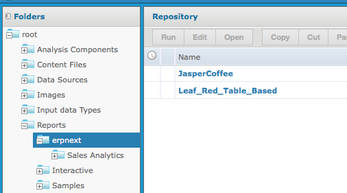
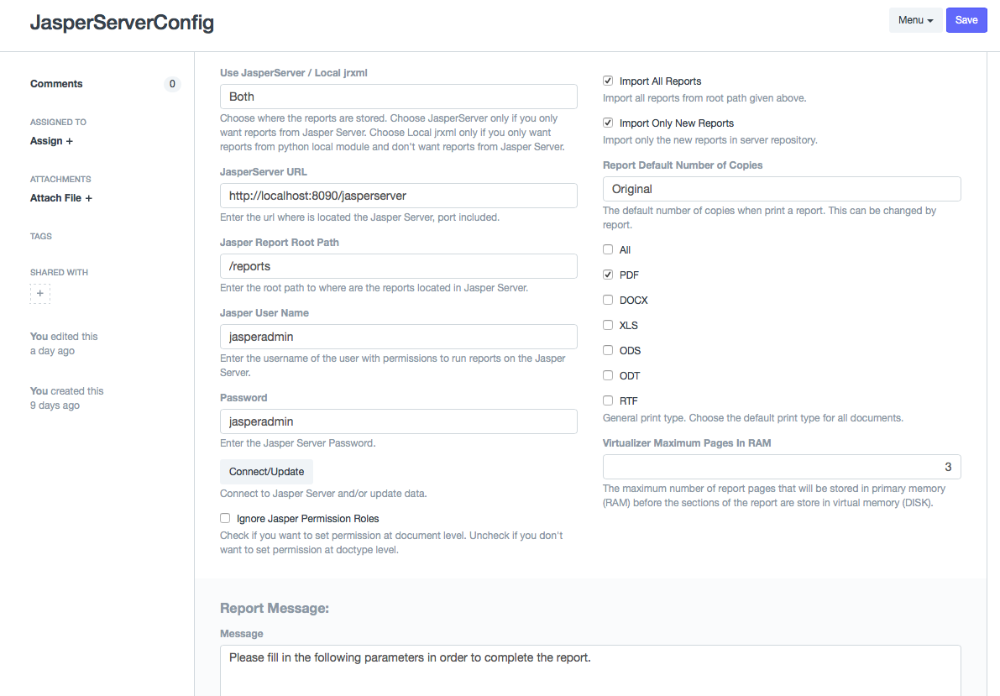
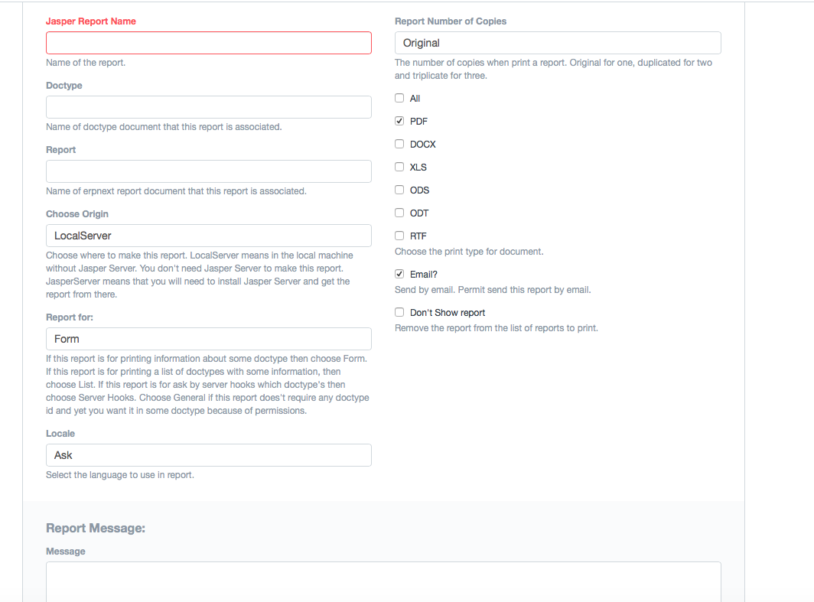

Jasper Erpnext Report
=============================
This project is a module to work with frappe framework. It integrate [JasperReports](http://community.jaspersoft.com/project/jasperreports-library) with frappe framework.
You can make your reports in [Jaspersoft Studio](http://community.jaspersoft.com/project/jaspersoft-studio) and import them in frappe with this module or send it to [JasperReports® Server](http://community.jaspersoft.com/project/jasperreports-server) and get it from there into the framework.
So you can use Jasper Erpnext Report in tree ways:

 - With JasperReports® Server mode - you need to install it.
 - Standalone mode.
 - Standalone and JasperReports® Server mode.
 
JasperReports® Server
=======
You make your reports in Jaspersoft Studio and put them in JasperReports Server. This way your reports are centralized. From Jasper Erpnext Report you get the reports that you want. After configure it you can send it to the JasperReports Server and get it back in pdf, docx,  xls, odds, dot and rtf. 

Standalone mode
==========
Here you don't need JasperReports Server. You make yours reports in Jaspersoft Studio and import them with Jasper Erpnext Report into frappe framework.
This module make the reports when asked to. In Standalone mode you can make more reports than in JasperReports Server mode.

How to Install
--------------

 1. Get Jasper Erpnext Report with `bench get-app jasper_erpnext_report https://github.com/saguas/jasper_erpnext_report.git`
 2.  Make sure you install **java jdk** - in ubuntu: `sudo apt-get install openjdk-7-jdk`.
 3.  Also you will need microsoft TrueType fonts (ttf-mscorefonts-installer) installed. In ubuntu - `sudo apt-get install ubuntu-restricted-extras` or `apt-apt install ttf-mscorefonts-installer` - you may need to uncomment multiverse in `/etc/apt/source.list`.
 4. Install in the framework with `bench install-app jasper_erpnext_report` 
 5. Install pyjnius with `bench update --requirements` 

How to use it?
==============

JasperReports® Server
---------------------
First, make a folder, in JasperReports® Server, to put the reports to use with this module - name it, for instance, erpnext.
Second, make your reports in Jaspersoft Studio and send them, from studio to the folder created in the first step, to JasperReports Server. 

Now to import the folder (in my case is *`reports/`*) go to `Jasper Erpnext Report -> setup -> JasperServerConfig`. Once there make sure that *`Import All Reports`* is selected and make some configurations.

After this you just have imported the settings of each report into the framework. That is all you need to make some decisions.

After that go to `Jasper Erpnext Report -> Jasper Reports` and configure each report as you plan when made it. See below how to configure reports.

Standalone mode
---------------

In this mode you just need to make the reports in Jaspersoft Studio. The simplest reports are made of one file with extension `jrxml` and some images and maybe some `localization_pt.properties` files. 
Then you need to import them into the framework. **See the `examples/` Folder**. The images must have, inside jrxml file, relative reference. So you must import them into Jaspersoft Studio when you are making your report - at the design time. Note that you still need to import them into the frappe framework after you finish the reports.
The localization files don't need to be imported if they are in `Java path`.

To import the report just go to `Jasper Erpnext Report -> Documents -> Jasper Reports` make a new report (you just need to give a name) and before you can import the files that make your report you need to save the document. After save it an upload button appears. Note that after all files are imported you need to save again to make it permanent and to check if every thing is ok and all files needed were uploaded.
Again, you need to configure each doctype Jasper Reports document and then save them to take effect.

